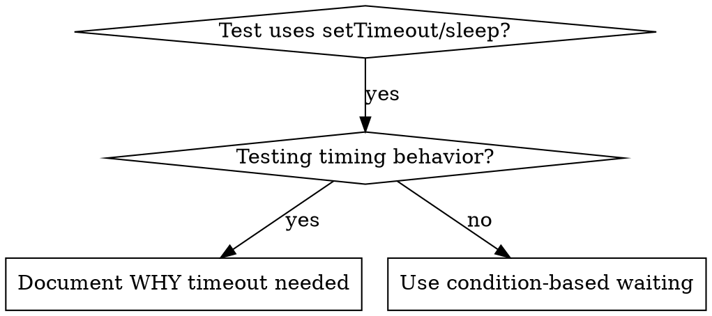

# Condition-Based Waiting
## Overview
Flaky tests often guess at timing with arbitrary delays. This creates race conditions where tests pass on fast machines but fail under load or in CI.
**Core principle:** Wait for the actual condition you care about, not a guess about how long it takes.
## When to Use

**Use when:**
- Tests have arbitrary delays (`setTimeout`, `sleep`, `time.sleep()`)
- Tests are flaky (pass sometimes, fail under load)
- Tests timeout when run in parallel
- Waiting for async operations to complete
## Core Pattern
```typescript
// BEFORE: Guessing at timing
await new Promise(r => setTimeout(r, 50));
const result = getResult();
expect(result).toBeDefined();

// AFTER: Waiting for condition
await waitFor(() => getResult() !== undefined);
const result = getResult();
expect(result).toBeDefined();
```
## Quick Patterns
| Scenario | Pattern |
|----------|---------|
| Wait for event | `waitFor(() => events.find(e => e.type === 'DONE'))` |
| Wait for state | `waitFor(() => machine.state === 'ready')` |
| Wait for count | `waitFor(() => items.length >= 5)` |
| Wait for file | `waitFor(() => fs.existsSync(path))` |
| Complex condition | `waitFor(() => obj.ready && obj.value > 10)` |
## Implementation
Generic polling function:
```typescript
async function waitFor<T>(
  condition: () => T | undefined | null | false,
  description: string,
  timeoutMs = 5000
): Promise<T> {
  const startTime = Date.now();

  while (true) {
    const result = condition();
    if (result) return result;

    if (Date.now() - startTime > timeoutMs) {
      throw new Error(`Timeout waiting for ${description} after ${timeoutMs}ms`);
    }

    await new Promise(r => setTimeout(r, 10)); // Poll every 10ms
  }
}
```
## Common Mistakes
** Polling too fast:** `setTimeout(check, 1)` - wastes CPU
** Fix:** Poll every 10ms
## When Arbitrary Timeout IS Correct
```typescript
// Tool ticks every 100ms - need 2 ticks to verify partial output
await waitForEvent(manager, 'TOOL_STARTED'); // First: wait for condition
await new Promise(r => setTimeout(r, 200));   // Then: wait for timed behavior
// 200ms = 2 ticks at 100ms intervals - documented and justified
```
## Real-World Impact
From debugging session (2025-10-03):
- Fixed 15 flaky tests across 3 files
- Pass rate: 60% → 100%
- Execution time: 40% faster
- No more race conditions
## ⚠️ Tratamento de Exceções e Edge Cases
### Tratamento de Exceções
*   Sempre inclua um bloco `try-catch` para capturar e tratar exceções que possam ocorrer durante a execução da função `waitFor`.
*   Certifique-se de que as exceções sejam tratadas de forma apropriada, seja logando o erro, seja retornando um valor padrão ou seja lançando uma exceção personalizada.
```typescript
try {
  await waitFor(() => getResult() !== undefined);
} catch (error) {
  console.error('Erro ao esperar pela condição:', error);
  // Trate a exceção de acordo com as necessidades da sua aplicação
}
```
### Edge Cases
*   **Condição nunca atendida:** Se a condição nunca for atendida, a função `waitFor` entrará em um loop infinito. Para evitar isso, é importante incluir um timeout e lançar uma exceção quando o timeout for alcançado.
*   **Condição atendida imediatamente:** Se a condição for atendida imediatamente, a função `waitFor` retornará o valor sem esperar. Isso pode ser um problema se a condição for atendida antes que a função `waitFor` seja chamada. Para evitar isso, é importante garantir que a condição seja verificada apenas após a chamada da função `waitFor`.
*   **Múltiplas condições:** Se houver múltiplas condições que precisam ser atendidas, é importante garantir que a função `waitFor` seja chamada para cada condição separadamente. Isso pode ser feito usando um loop ou uma função recursiva.
```typescript
const conditions = [() => getResult1() !== undefined, () => getResult2() !== undefined];
for (const condition of conditions) {
  await waitFor(condition);
}
```
### Exemplos de Edge Cases
*   **Condição que depende de uma variável externa:** Se a condição depende de uma variável externa, é importante garantir que a variável seja atualizada antes de chamar a função `waitFor`.
*   **Condição que depende de um evento:** Se a condição depende de um evento, é importante garantir que o evento seja ouvido antes de chamar a função `waitFor`.
```typescript
// Condição que depende de uma variável externa
let externalVariable = false;
await waitFor(() => externalVariable);
externalVariable = true;

// Condição que depende de um evento
const eventListener = () => {
  // Faça algo quando o evento ocorrer
};
await waitFor(() => eventListener);
